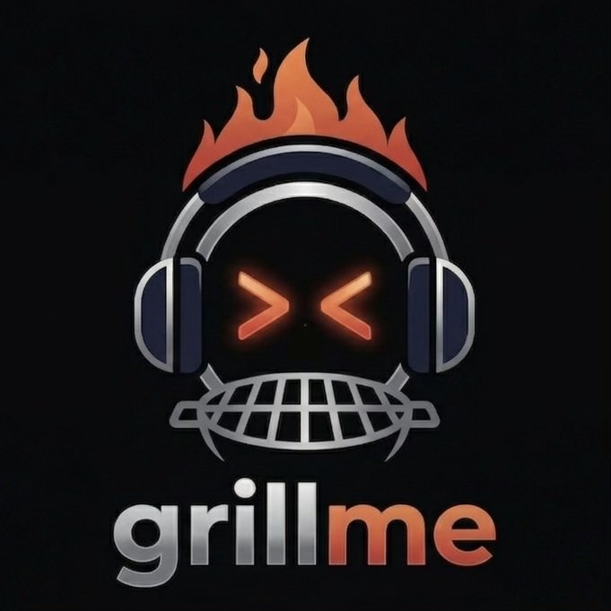

<div align="center">



# grillme

**AI mock interview platform — fully local, completely free.**

Paste a job description → get a real LeetCode problem matched to the company → practice with a voice-driven AI interviewer → receive a six-axis scorecard.

[](https://fastapi.tiangolo.com)
[](https://react.dev)
[](https://python.org)
[](#)

</div>

---

## What it does

```
You paste a JD  →  grillme picks a real LeetCode problem that company asks
                →  a talking AI interviewer grills you by voice
                →  you code in a Monaco editor while explaining your thinking
                →  you get a six-axis scorecard with specific feedback
```

No hand-holding. No hints. The interviewer pushes back on vague answers, expects clarifying questions, and scores you on exactly the same dimensions real interviewers use.

---

## Features

| | |
|---|---|
| **Voice-first** | Push-to-talk → faster-whisper STT → LLM → edge-TTS → wav2lip talking avatar |
| **Real problems** | Scraped from candidate GitHub repos, frequency-weighted per company |
| **Six-axis scorecard** | Technical correctness · Process of thought · Curiosity · Self-presentation · Closing questions · Code quality |
| **Pluggable LLM** | Groq · Gemini · OpenAI · Ollama (fully local, zero cost) |
| **Multi-agent pipeline** | ParseAgent → ProblemAgent → PersonaAgent → ScorerAgent → MemoryAgent |
| **Cross-session memory** | Weakness tags persist — grillme pressure-tests your gaps next time |
| **Zero lock-in** | Self-hosted, no account, no subscription, no data leaves your machine |

---

## Stack

| Layer | Tech |
|-------|------|
| Frontend | React 19, TypeScript, Vite, Tailwind 3, shadcn/ui, Monaco editor |
| Backend | FastAPI, Python 3.13, SQLAlchemy async, SQLite, uv |
| Voice | faster-whisper (STT) · edge-tts (TTS) · Silero VAD · wav2lip ONNX |
| Agents | Custom orchestrator-workers — no LangChain |
| Deploy | Docker Compose (backend + frontend nginx + avatar sidecar) |

---

## Quickstart — Local dev (no Docker)

**1. Clone and configure**

```bash
git clone https://github.com/salawhaaat/grillme.git
cd grillme
cp .env.example .env
```

**2. Pick a free LLM provider**

```env
# Groq — free, fastest
LLM_PROVIDER=groq
LLM_MODEL=llama-3.3-70b-versatile
GROQ_API_KEY=gsk_...          # console.groq.com

# Google Gemini — generous free tier
# LLM_PROVIDER=gemini
# LLM_MODEL=gemini-2.0-flash
# GEMINI_API_KEY=AIza...      # aistudio.google.com

# Fully local — zero API cost
# LLM_PROVIDER=ollama
# LLM_MODEL=llama3.1
# (requires: ollama serve && ollama pull llama3.1)
```

**3. Run backend**

```bash
cd backend
uv sync
uv run uvicorn app.main:app --reload
# → http://localhost:8000/docs
```

**4. Run frontend**

```bash
cd frontend
pnpm install
pnpm dev
# → http://localhost:5173
```

---

## Docker Compose — full stack with talking avatar

```bash
# One-time: download wav2lip model (~360 MB)
./download_models.sh

# Build and start everything
docker compose build
docker compose up
# → http://localhost:80
```

> Without the model file the avatar service returns 503 and the app falls back to a static photo — everything else still works.

---

## Environment variables

```env
# LLM (required)
LLM_PROVIDER=groq                              # groq | gemini | openai | ollama | ollama_cloud
LLM_MODEL=llama-3.3-70b-versatile
GROQ_API_KEY=
GEMINI_API_KEY=
OPENAI_API_KEY=

# Database
DATABASE_URL=sqlite+aiosqlite:///./app/data/grillme.db

# Avatar (optional — wav2lip needs Docker)
AVATAR_PROVIDER=local                          # local | wav2lip
AVATAR_SERVICE_URL=http://localhost:8080
VIDEOS_DIR=/tmp/grillme_videos
```

---

## Voice pipeline

```
PTT button held  →  MediaRecorder (WebM/Opus)
                 →  POST /api/stt  →  faster-whisper base.en  →  transcript
                 →  POST /api/converse/respond  →  LLM response text
                 →  edge-tts  →  MP3 audio  (plays in ~2s)
                 →  wav2lip ONNX  →  MP4 video  (plays when ready, muted if audio finished)
```

Thinking filler clips ("Mm.", "Right.", "I see.") are pre-rendered at startup and play immediately on PTT release — bridging the LLM latency gap.

---

## Agent pipeline

```
POST /sessions/create
  └── Orchestrator
        ├── ParseAgent      — extracts company / role / seniority from JD
        ├── ProblemAgent    — picks real LeetCode problem from GitHub question bank
        └── PersonaAgent    — builds interviewer character + voice

POST /sessions/{id}/finish
  └── Orchestrator
        ├── ScorerAgent     — six-axis evaluation of the full conversation
        └── MemoryAgent     — tags weaknesses, persists cross-session
```

Rules: agents never call LLM providers directly (always via `LLMService`), agents don't call each other (Orchestrator wires them), all I/O is typed Pydantic.

---

## Six-axis scorecard

| Axis | What it measures |
|------|-----------------|
| **Technical correctness** | Algorithm correctness, edge cases, complexity |
| **Process of thought** | Thinking aloud, structured approach, recovery |
| **Curiosity** | Clarifying questions asked before coding |
| **Self-presentation** | Confidence, clarity, how they talk about themselves |
| **Closing questions** | Meaningful questions asked to the interviewer |
| **Code quality** | Readability, naming, idiomatic Python |

> The `curiosity` axis is graded silently — the interviewer never prompts you to ask questions. Candidates who dive straight into coding without clarifying lose points, just like in real interviews.

---

## Test pages

| URL | Purpose |
|-----|---------|
| `/stt-test` | Hold-to-record STT test with debug log |
| `/avatar-test` | Render a wav2lip video for any text, inspect generated videos |

---

## Running tests

```bash
cd backend && uv run pytest -x -q
```

---

## Free LLM providers

| Provider | Free tier | Best model |
|----------|-----------|------------|
| [Groq](https://console.groq.com) | Yes | `llama-3.3-70b-versatile` |
| [Google AI Studio](https://aistudio.google.com) | Yes | `gemini-2.0-flash` |
| [Ollama](https://ollama.com) | Local | `llama3.1`, `qwen2.5-coder:7b` |
| [OpenRouter](https://openrouter.ai) | Free tier | Many |

---

## Roadmap

| | Feature |
|---|---------|
| ✅ | Core backend + multi-agent pipeline |
| ✅ | LeetCode URL + curated question bank |
| ✅ | Voice loop — PTT, STT, TTS, wav2lip avatar |
| ✅ | Six-axis scorecard + cross-session memory |
| ✅ | Docker Compose deployment |
| ✅ | Pluggable LLM providers (Groq, Gemini, OpenAI, Ollama) |
| 🔲 | Structured interview phases (behavioral → coding checklist) |
| 🔲 | PostgreSQL + Alembic migrations |
| 🔲 | Web search tool use during problem research |
